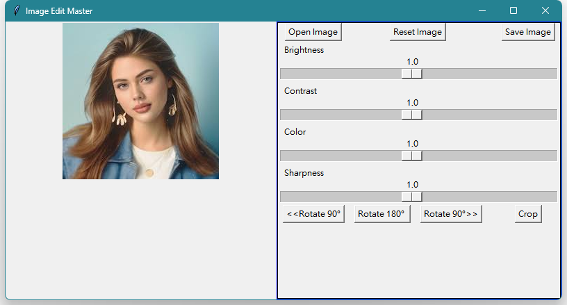
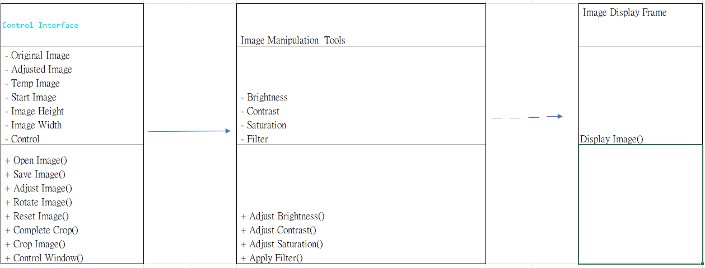
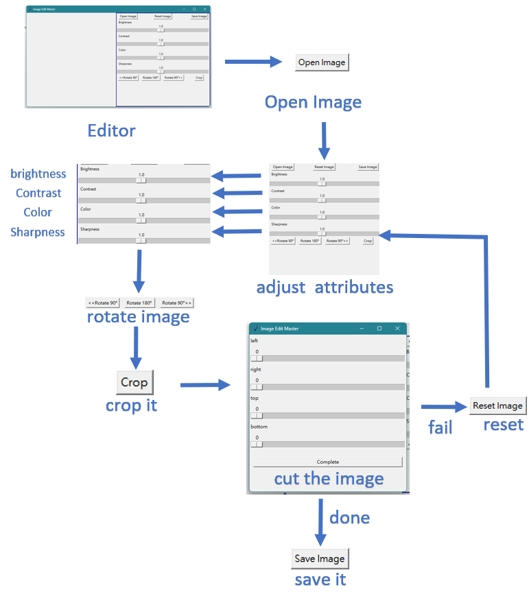
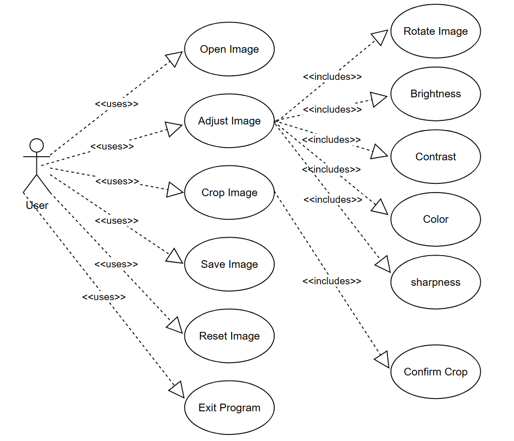
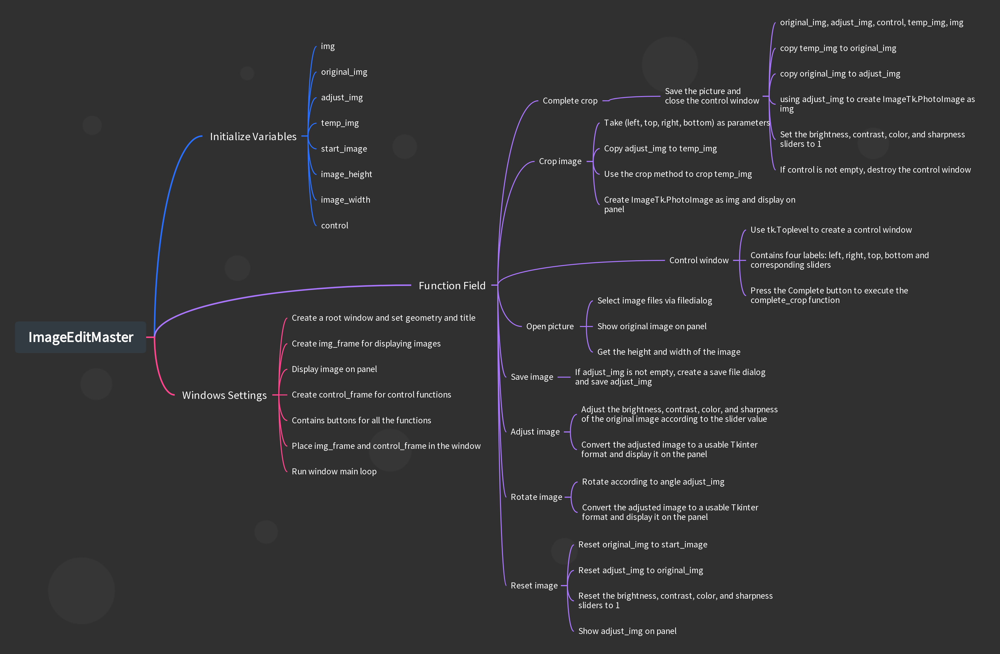

## Youtube
https://www.youtube.com/watch?v=xqpAXf7tAnM

# Image Editing Application

This is an image editing application that allows users to adjust image properties, rotate images, crop images, and save the edited images.

## Purpose and Target Market

The purpose of this software is to provide users with a user-friendly image editing application. It is designed for individuals, photographers, graphic designers, or anyone who needs to edit and enhance images.

## Software Development Process

The software development process applied for this project is Agile. Agile methodologies, such as Scrum or Kanban, have been chosen for their flexibility, adaptability, and ability to incorporate frequent customer feedback. The Agile approach allows for iterative development, continuous improvement, and collaboration among team members.

## Development Plan

- Implement advanced filters, text overlay, and batch processing for enhanced editing capabilities.
- Introduce image effects like blurring, vignetting, and lens distortion to enhance artistic appeal.
- Enable social media integration for easy sharing of edited images.
- Add undo/redo functionality and advanced editing tools for more precise edits.
- Explore collaboration features, cross-platform compatibility, and performance optimization.
- Gather user feedback and conduct market research to inform future enhancements.
- Prioritize bug fixes, quality assurance, continuous learning, and innovation.
- Engage with the community to foster a sense of ownership and involvement.
#UML

#graphical abstract

#use case diagram

#Overview

### Development Process

- Agile (Scrum or Kanban)

### Team Members and Roles

- Software Developers: Responsible for developing the application's functionality.
- UI/UX Designers: Responsible for designing the user interface and ensuring a user-friendly experience.
- QA/Testers: Responsible for testing and quality assurance.

### Schedule

- Sprint 1: Project kickoff, planning, and initial UI/UX design (2 weeks)
- Sprint 2: Implement basic functionality and perform unit testing (3 weeks)
- Sprint 3: Implement advanced features, conduct integration testing, and refine UI/UX design (4 weeks)
- Sprint 4: Enhance UI/UX, optimize performance, and conduct user acceptance testing (3 weeks)
- Sprint 5: Final refinements, documentation, and final testing (2 weeks)

## Algorithm

The specific algorithms used in the image editing application are not mentioned in the provided document. However, algorithms related to image manipulation, such as adjusting brightness, contrast, and color balance, may be employed.

## Current Status and Future Plans

- Further enhancements to existing features
- Bug fixes and performance improvements
- Addition of new features based on user feedback and market demands

## Environments

- Programming Language: Python
- Minimum Hardware and Software Requirements: The minimum requirements for running the software will depend on the specific libraries, frameworks, and dependencies used. These requirements are not mentioned in the provided document.
- Required Packages: The software may require packages such as Tkinter, PIL (Python Imaging Library), and other related packages for GUI development and image manipulation. Specific package requirements are not mentioned in the provided document.
